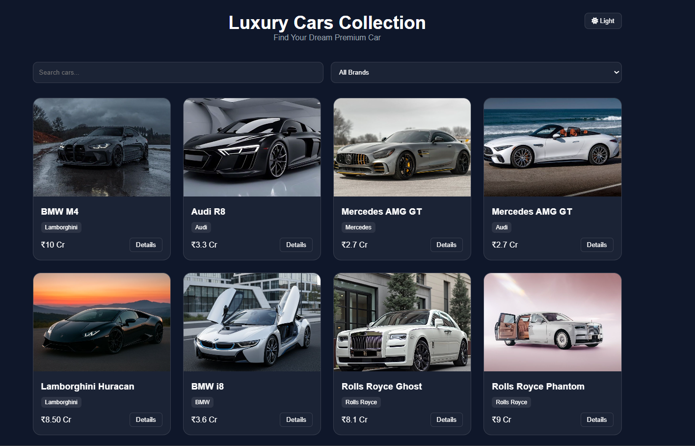
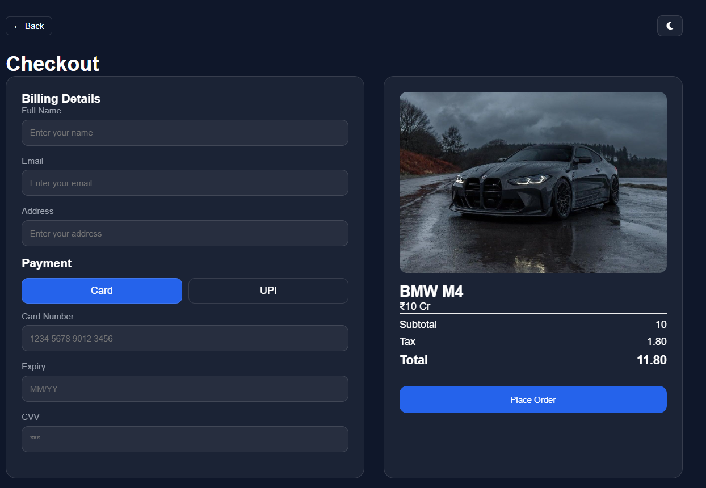
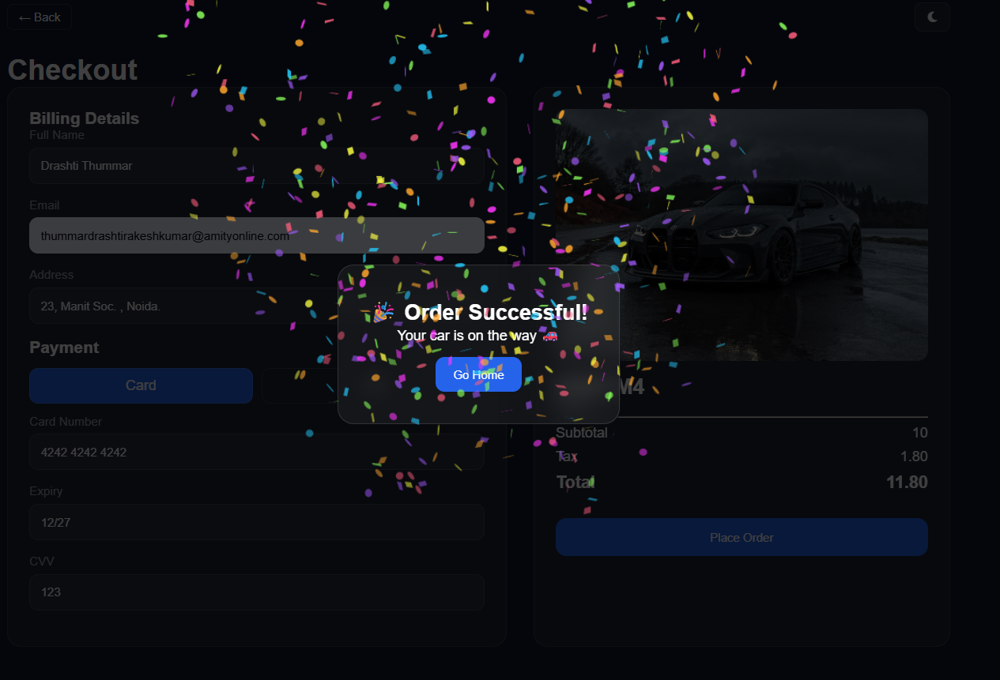

<p align="center">
  
</p>

<h1 align="center">🚗 Luxury Cars Collection</h1>

<p align="center">
  <b>Premium Car Showcase • Interactive Buying Experience</b><br/>
  <sub>Designed with modern UI, smooth interactions, and real-world user flow</sub>
</p>

<p align="center">
  <i>Scroll ↓ to explore the experience</i>
</p>

---

## 🎬 Live Preview

<p align="center">
  <b>🚀 Experience the project live</b><br/><br/>
  <a href="https://drash011.github.io/Luxury-Cars-Collection">https://drash011.github.io/Luxury-Cars-Collection</a>
</p>

---

## 🌌 Product Vision

This project is a **complete frontend product experience**, not just a UI.

It simulates how users:
- Discover luxury cars  
- Explore detailed specifications  
- Make decisions  
- Complete a seamless checkout  

All built with a focus on **clarity, elegance, and usability**.

---

## ⚡ Core Features

### 🚘 Car Listing Experience
- Clean grid-based layout  
- Brand filtering & search  
- Smooth hover interactions  

---

### 🔍 Car Details View

<p align="center">
  
</p>

- Image gallery preview  
- Specifications panel  
- Performance insights  
- Wishlist & Buy options  

---

### 💳 Checkout Flow

<p align="center">
  
</p>

- Billing form UI  
- Card / UPI selection  
- Price breakdown  
- Real-world checkout feel  

---

### 🎉 Order Success Interaction

<p align="center">
  
</p>

- Animated success popup  
- Confetti effect  
- Smooth feedback experience  

---

## 🔄 User Flow


```text
Browse → Select Car → View Details → Wishlist / Buy → Checkout → Success 🎉
```

## 🛠️ Tech Stack
<p align="center"> HTML5 &nbsp;&nbsp;•&nbsp;&nbsp; CSS3 &nbsp;&nbsp;•&nbsp;&nbsp; JavaScript </p>

---

## 🧠 What This Project Demonstrates

✔ Strong frontend fundamentals<br/>
✔ Ability to build real-world UI flows<br/>
✔ Clean and modern UI design<br/>
✔ Interactive and user-friendly experience<br/>
✔ Structured and maintainable code

---

## 📁 Project Structure

```
luxury-cars-website/
│
├── css/
├── js/
├── images/
│   ├── home.png
│   ├── details.png
│   ├── checkout.png
│   └── success.png
│
├── index.html
├── details.html
├── checkout.html
│
└── README.md
```

---

## 🚀 Run Locally

Follow these steps to run the project on your system:

```bash
git clone https://github.com/Drash011/Luxury-Cars-Collection

cd luxury-cars-website
```

---

## 👩‍💻 Developer
<p align="center"> <b>Drashti Thummar</b><br/> Frontend Developer<br/><br/> <i>Focused on building clean, interactive, and premium web experiences</i> </p>

---

<p align="center">
  💡 Turning ideas into elegant &nbsp;•&nbsp; ⚡ interactive &nbsp;•&nbsp; 🎯 user-focused digital experiences
</p>
